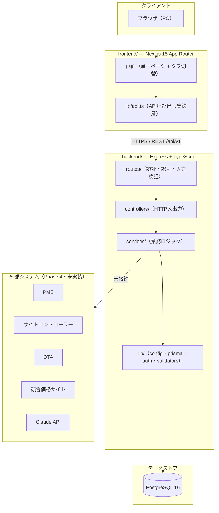

# 基本設計書

## AIレベニュー管理システム（AI Revenue Management System）

| 項目 | 内容 |
| --- | --- |
| 版数 | 1.0 |
| 作成日 | 2026-08-05 |
| 対象システム | AIレベニュー管理システム（ホテル収益管理SaaS） |
| 上位文書 | `要件定義書.md`、GEAR.indigo Biz「AIホテル」プロジェクト成果物 |
| 下位文書 | `docs/詳細設計書.md`、`docs/テスト仕様書.md` |

---

## 目次

1. [本書の位置づけと入力情報](#1-本書の位置づけと入力情報)
2. [システム全体構成](#2-システム全体構成)
3. [方式設計](#3-方式設計)
4. [機能構成と実装スコープ](#4-機能構成と実装スコープ)
5. [データモデル設計](#5-データモデル設計)
6. [画面構成](#6-画面構成)
7. [外部連携方式](#7-外部連携方式)
8. [非機能設計](#8-非機能設計)
9. [未確定事項](#9-未確定事項)

---

## 1. 本書の位置づけと入力情報

### 1.1 目的

本書は、要件定義工程で確定した業務要件・機能要件を、実装可能な単位のシステム構成・方式・データモデルへ落とし込むことを目的とする。個々のモジュール内部の処理仕様は `docs/詳細設計書.md` に記述する。

### 1.2 入力情報

本書は以下を入力として作成した。

| 出所 | 成果物 | 内容 |
| --- | --- | --- |
| GEAR.indigo Biz | プロジェクト概要 | プロジェクト目的・スコープ・ステークホルダー・スケジュール |
| GEAR.indigo Biz | 業務要件一覧 | BR-001〜BR-082（10カテゴリ、82件） |
| GEAR.indigo Biz | 機能要件一覧 | FR-001〜FR-050（50件、優先度 高31/中18/低1） |
| GEAR.indigo Biz | 業務フロー | 10カテゴリのシーケンス定義 |
| 本リポジトリ | `要件定義書.md` | 実装済み機能の要件記述（F-XX-NN 体系） |
| 本リポジトリ | `AGENTS.md` | 確定済みの技術・ドメイン制約 |

### 1.3 要件ID体系の対応関係

本プロジェクトには2系統の要件IDが並存する。本書では両者を併記する。

- **BR-nnn / FR-nnn**: GEAR.indigo Biz 上で管理される業務要件・機能要件。到達目標としての全体像を示す。
- **F-XX-nn**: 本リポジトリの `要件定義書.md` で管理される実装単位の機能要件。現在コードとして存在するものを示す。

> **注意**: 業務要件一覧の各項目には多数の「※要確認」が付記されている。これは要件定義工程で確定に至らなかった事項であり、本書では第9章に整理した。設計上の前提として扱う際は必ず確認結果を反映すること。

---

## 2. システム全体構成

### 2.1 構成方針

pnpm によるモノレポ構成とし、フロントエンド・バックエンド・共通型定義を単一リポジトリで管理する。クラウドベンダー固有のサービスに依存しない構成とし、バックエンドはコンテナとしてどの実行基盤にも配置できる状態を維持する。

### 2.2 全体構成図



### 2.3 技術スタック（確定）

| レイヤ | 採用技術 | 配置 |
| --- | --- | --- |
| フロントエンド | Next.js 15（App Router）、shadcn/ui、Tailwind CSS | Vercel |
| バックエンド | Express、TypeScript、Prisma | コンテナ（AWS/GCP非依存） |
| データベース | PostgreSQL 16 | コンテナ／マネージドDB |
| 共通型 | `shared/`（`@shared/types`） | 両者から参照 |

`AGENTS.md` により、バックエンドを FastAPI へ移行しないこと、クラウド固有SDKを追加しないことが確定事項として定められている。本設計はこれに従う。

### 2.4 ワークスペース構成

| ディレクトリ | 責務 |
| --- | --- |
| `frontend/` | 画面表示、ユーザー操作、API呼び出し |
| `backend/` | 認証・認可、業務ロジック、永続化 |
| `shared/` | フロントエンド・バックエンド共通の型定義 |
| `docker/` | 開発用 PostgreSQL の起動定義 |
| `docs/` | 設計文書（本書、詳細設計書、テスト仕様書、サマリー） |

---

## 3. 方式設計

### 3.1 認証方式

JWT によるアクセストークンと、リフレッシュトークンの2本立てとする。

| 項目 | 方式 |
| --- | --- |
| アクセストークン | JWT。`Authorization: Bearer <token>` ヘッダで送信 |
| リフレッシュトークン | ランダム文字列。DBには SHA-256 ハッシュのみを保存（`hashToken()`） |
| 署名鍵 | `JWT_SECRET`（32文字以上必須。未設定時は起動時に例外送出） |
| 秘密情報の既定値 | コード中にフォールバック値を持たない |

平文のリフレッシュトークンをDBに保存しない方式とすることで、DB漏洩時にセッションを直接奪取されることを防ぐ。

認証を要さない公開エンドポイントは以下の3つに限定する。

- `POST /api/v1/auth/login`
- `POST /api/v1/auth/refresh`
- ヘルスチェック

### 3.2 認可方式

ロールは ADMIN / MANAGER / OPERATOR の3種で確定している（`AGENTS.md`）。

| ミドルウェア | 責務 | 適用対象 |
| --- | --- | --- |
| `authenticate` | JWT検証、ユーザー特定 | 公開3経路を除く全ルート |
| `requireHotelAccess(...)` | 対象ホテルへのアクセス権検証 | hotelId を受け取る全ルート |
| `requireRole('ADMIN','MANAGER')` | ロールによる操作制限 | 変更系ルート |
| `validate(schema, source)` | zod による入力検証 | 入力を受け取る全ルート |

> **要確認事項**: 機能要件 FR-003 / FR-005 は「本部管理・管理者・オペレーター・閲覧のみ」の4権限を前提としている。現行の確定ロールは3種であり、「本部管理」と「閲覧のみ」の扱いが未整合である。第9章 Q-01 として整理した。

### 3.3 テナント分離方式

マルチテナントSaaSであり、テナント分離の違反は本番事故に直結する。以下を必須ルールとする。

1. 全ての業務データモデルに `tenantId` とテナントリレーション、`@@index([tenantId])` を付与する。
2. データ取得クエリは必ず `hotelId` または `tenantId` で絞り込む。
3. hotelId を外部から受け取るルートには `requireHotelAccess(...)` を適用し、他テナントのIDを指定しても到達できないようにする。

### 3.4 アーキテクチャ境界

クラウド／BaaS の選定が未確定であるため、差し替え可能性を保つ境界を設ける。ESLint により違反をエラーとして検出する。

| 境界 | ルール | 理由 |
| --- | --- | --- |
| 環境変数 | バックエンドで `process.env` を直接参照しない。`src/lib/config.ts` の `config` 経由に統一 | 環境変数・シークレット読み込み箇所を一元化し、基盤変更時の影響範囲を限定する |
| Prismaクライアント | import できるのは `src/services/` と `src/lib/` のみ。controllers/routes はサービス関数を呼ぶ | 永続化技術の差し替え時に上位層を変更不要にする |
| 需要予測 | `DemandForecaster` インタフェース経由で呼び出す | ルールベース実装を将来 ML モデルへ差し替え可能にする |

### 3.5 API契約

| 項目 | 規約 |
| --- | --- |
| パス | `/api/v1/<領域>` |
| 成功応答 | `{ success: true, data }` |
| 失敗応答 | `{ success: false, error, errors? }` |
| 生成箇所 | `utils/response.ts` / `middlewares/errorHandler.ts` |

独自のレスポンス形式を作らないこと。

### 3.6 フロントエンド方式

| 項目 | 方式 |
| --- | --- |
| API呼び出し | `frontend/lib/api.ts` に集約。コンポーネント内で直接 fetch しない |
| 通信失敗時 | モックへのサイレントフォールバックを禁止。ローディング・エラー・再試行を明示表示する |
| 表示言語 | 日本語 |
| 対応端末 | PC（スマートフォン最適化は対象外） |

---

## 4. 機能構成と実装スコープ

### 4.1 サブシステム構成

機能要件 FR-001〜FR-050 を、実装単位のサブシステムへ以下のとおり割り当てる。

| # | サブシステム | 対応FR | 対応BRカテゴリ | 実装状況 |
| --- | --- | --- | --- | --- |
| S1 | 認証・認可 | FR-001〜FR-006 | アカウント・権限・セキュリティ | 一部実装 |
| S2 | マスタ管理 | FR-007〜FR-014、FR-022 | 初期設定・マスタ管理 | 一部実装 |
| S3 | 外部連携 | FR-015〜FR-021 | PMS・サイトコントローラー・OTA連携 | 未実装（Phase 4） |
| S4 | 収益管理・価格最適化 | FR-023〜FR-028 | 収益管理・価格最適化 | 一部実装 |
| S5 | 団体管理 | FR-029〜FR-032 | 団体管理・需要配分ルール | データ層のみ |
| S6 | 競合価格収集 | FR-033〜FR-038 | 競合価格収集・外部サイト取得 | データ層のみ |
| S7 | AIチャット | FR-039 | 収益管理・価格最適化 | 未実装（Phase 4） |
| S8 | デモ配布管理 | FR-040〜FR-044 | デモ配布・アクセス管理 | 未実装 |
| S9 | 販促・営業支援 | FR-045〜FR-048 | LP・HP・営業支援 | システム化対象外（別途運用） |
| S10 | プロジェクト進行管理 | FR-049〜FR-050 | プロジェクト進行管理 | システム化対象外（別途運用） |

### 4.2 実装済み機能

現在コードとして動作する機能は以下である。データは seed により投入される。

| サブシステム | 機能 | 提供API |
| --- | --- | --- |
| S1 認証・認可 | ログイン、トークン更新、ログアウト、全端末ログアウト、自己情報取得、ユーザー登録 | `/api/v1/auth/*` |
| S2 マスタ管理 | ホテルCRUD、ホテル設定変更、料金ランクCRUD | `/api/v1/hotels/*`、`/api/v1/settings/*` |
| S4 収益管理 | KPI表示、KPI比較、アラート、価格カレンダー、価格戦略設定、月間着地シミュレーション、需要予測再計算 | `/api/v1/dashboard/*`、`/api/v1/pricing/*` |
| S4 分析 | 月次推移、競合比較、レビュースコア、ブッキングカーブ、競合価格 | `/api/v1/analysis/*`、`/api/v1/daily/*` |
| S2 イベント管理 | イベントCRUD | `/api/v1/events` |

### 4.3 未実装機能（Phase 4）

以下は対応するDBテーブルとAPIの器のみが存在し、実処理は未実装である。**実装済みと報告してはならない。**

- PMS / サイトコントローラー / OTA 連携（FR-015〜FR-021）
- 競合価格スクレイピング（FR-033〜FR-038 の収集処理）。`CompetitorPriceData.dataSource` に `scraping` の区分は存在するが、収集処理そのものは存在しない
- 需要予測の機械学習モデル（FR-024。現在はルールベース実装）
- Claude API によるAIコメント生成（FR-039、および `AiComment` の内容生成）。現在の `AiComment` は seed 投入値を返すのみ
- バッチジョブ基盤（FR-019、FR-027、FR-035、FR-044）。需要予測の再計算は `POST /api/v1/pricing/recompute` による同期実行のみ

### 4.4 実装済みだが画面から到達できない機能

以下はバックエンドに実処理が存在するが、フロントエンドから呼び出されていない。機能としては未完成であり、リリース判定時には未提供として扱う。

| 機能 | バックエンド | フロントエンド |
| --- | --- | --- |
| 月次レポートのPDF/Excel出力 | 実装済み（ExcelJS / pdfkit。日本語フォントを同梱し文字化けを回避） | `reports-tab.tsx` はAPIを呼ばず静的表示のみ |
| KPI前月比較 | `GET /api/v1/dashboard/kpi/comparison` | `lib/api.ts` に対応関数なし |
| 月間着地シミュレーション | `GET /api/v1/pricing/simulation` | 同上 |
| 需要予測の再計算 | `POST /api/v1/pricing/recompute` | 同上 |
| レビュースコア参照 | `GET /api/v1/analysis/reviews` | 同上 |
| 料金ランクの追加・削除 | `POST` / `DELETE /api/v1/settings/price-ranks` | 更新のみ実装、追加・削除は未接続 |
| ホテルの追加・更新・削除 | `POST` / `PUT` / `DELETE /api/v1/hotels` | 同上 |
| ユーザー登録・全端末ログアウト | `POST /api/v1/auth/register`、`/logout-all` | 同上 |

> **注記**: `AGENTS.md` の「未実装領域（Phase 4）」には PDF/Excel 出力が列挙されているが、実際にはバックエンド実装が存在する。文書間の不整合であり、第9章 Q-09 として確認対象に含める。

### 4.5 価格戦略の重み付けの接続（対応済み）

価格戦略の重み付け（`PricingStrategyConfig.weightOccupancy` / `weightAdr` / `weightCompetitor`）は、当初、保存・監査・合計100%の検証まで実装されていながら**価格算出ロジックから参照されていなかった**。需要予測は予測稼働率のみから推奨ランクを導出しており、重みを変更しても算出結果が変化しない状態であった。

現在は稼働率・ADR・競合の3観点をそれぞれ料金ランクへ写像し、設定された重みで加重平均する方式へ変更している（`services/forecast/strategyWeighting.ts`）。算出手順は詳細設計書 §4.6 に記述する。

ただし、各観点をランクへ写像する方式そのものは要件として確定していない。現行実装は「ADRは直近実績に、競合価格は当日の競合平均に価格を追随させる」という初版の解釈であり、確定後に見直す前提とする（第9章 Q-10）。

### 4.6 要件被覆状況

機能要件 FR-001〜FR-050 が参照する業務要件は72件であり、以下の10件はいずれの FR からも参照されていない。要件定義工程への差し戻し、または本設計での取り込み方針決定が必要である。

| BR-ID | 優先度 | カテゴリ | 内容 |
| --- | --- | --- | --- |
| BR-006 | 高 | 収益管理・価格最適化 | 団体客影響を加味した販売配分 |
| BR-013 | 高 | PMS・SC・OTA連携 | 施設側のデータ取得手順を標準化する |
| BR-067 | 高 | 管理画面・フロントUI | 団体管理の画面を追加する |
| BR-007 | 中 | 収益管理・価格最適化 | 団体種別ごとの需要影響考慮 |
| BR-009 | 中 | 収益管理・価格最適化 | 部屋タイプ別の販売最適化 |
| BR-021 | 中 | PMS・SC・OTA連携 | OTAから取得する対象サイトを施設ごとに選定する |
| BR-068 | 中 | 管理画面・フロントUI | モックアップを更新できるようにする |
| BR-070 | 中 | 管理画面・フロントUI | 管理画面の操作導線を標準化する |
| BR-077 | 中 | LP・HP・営業支援 | 外部向け訴求メッセージの整理 |
| BR-071 | 低 | 管理画面・フロントUI | 要求事項整理のための画面確認プロセスを設ける |

なお BR-006 / BR-007 / BR-009 は FR から未参照であるが、団体管理（FR-029〜FR-032）および価格最適化（FR-025）で実質的に扱われる余地がある。BR-067 は優先度「高」でありながら対応する画面要件が FR 側に存在しないため、優先的な確認を要する。

---

## 5. データモデル設計

### 5.1 モデル一覧

Prisma スキーマに定義されたモデルは24件、列挙型は4件である。マイグレーションは初期作成の1件（`20260704000000_init`）のみである。

| 区分 | モデル | 用途 |
| --- | --- | --- |
| テナント・認証 | `Tenant` | テナント（契約単位） |
| | `User` | 利用者 |
| | `RefreshToken` | リフレッシュトークン（SHA-256ハッシュ保存） |
| マスタ | `Hotel` | ホテル基本情報、週末定義 |
| | `RoomType` | 部屋タイプ |
| | `PriceRank` | 料金ランク（1〜40段階） |
| | `PricingStrategyConfig` | 価格戦略の重み付け |
| | `Competitor` | 競合ホテル |
| | `Event` | イベント |
| | `Campaign` | キャンペーン |
| 実績・予算 | `DailyData` | 日別実績 |
| | `DailyRoomData` | 日別・部屋タイプ別実績 |
| | `MonthlyBudget` | 月次予算 |
| | `BookingCurveData` | ブッキングカーブ |
| | `OtaChannelData` | OTAチャネル別実績 |
| | `KpiSnapshot` | KPIスナップショット |
| 分析・予測 | `AiPriceRecommendation` | 価格推奨（需要レベル付き） |
| | `MonthlyLandingSimulation` | 月間着地シミュレーション |
| | `CompetitorPriceData` | 競合価格 |
| | `ReviewScore` | レビュースコア |
| | `AiComment` | AIコメント（生成処理は未実装） |
| | `Alert` | アラート |
| 団体 | `GroupBooking` | 団体予約 |
| 監査 | `AuditLog` | 監査ログ |

列挙型: `UserRole`、`DemandLevel`、`AlertSeverity`、`AlertStatus`

### 5.2 テナント分離の実装

業務データモデルには `tenantId` とテナントリレーション、`@@index([tenantId])` を付与する。例として `PriceRank` は以下の構造を持つ。

```prisma
model PriceRank {
  id        String   @id @default(cuid())
  tenantId  String
  tenant    Tenant   @relation(fields: [tenantId], references: [id], onDelete: Cascade)
  hotelId   String
  hotel     Hotel    @relation(fields: [hotelId], references: [id], onDelete: Cascade)
  rank      Int      // 1〜40
  label     String   // R01, R02, ...
  price1P   Int
  price2P   Int
  price3P   Int?
  price4P   Int?
  isActive  Boolean  @default(true)
  ...
  @@unique([hotelId, rank])
  @@index([tenantId])
  @@index([hotelId])
}
```

新しいモデルを追加する際は、この構造を必ず踏襲すること。

### 5.3 スキーマ変更手順

- `prisma migrate dev` によりマイグレーションファイルを生成し、リポジトリにコミットする。
- `db:push` は使用しない。
- `migrate reset` / `--force-reset` / `--accept-data-loss` は禁止とし、実行前に必ずユーザー確認を得る。

---

## 6. 画面構成

### 6.1 構成方式

フロントエンドは App Router 上の単一ページ（`frontend/app/page.tsx`）を入口とし、認証状態と選択タブに応じて表示コンポーネントを切り替える構成とする。画面ごとのURL分割は現時点では行っていない。

| コンポーネント | 責務 |
| --- | --- |
| `auth-provider.tsx` | 認証状態の保持と配信 |
| `login-form.tsx` | ログイン画面 |
| `main-layout.tsx` | 認証後のレイアウトとタブ切替 |
| `components/tabs/` | 各機能タブの画面 |
| `chat-interface.tsx` | AIチャット画面（応答生成は未実装） |
| `campaign-participation-manager.tsx` | キャンペーン参加管理 |
| `segment-cross-analysis-settings.tsx` | セグメント分析設定 |
| `components/ui/` | shadcn/ui 由来の基礎部品 |

### 6.2 権限別表示

FR-003（権限別メニュー表示）に対応し、ログイン後に取得したロールに応じて表示メニューと操作可否を切り替える。判定の根拠はサーバ側のロールとし、画面側の制御は利便性のための補助と位置づける。サーバ側では `requireRole` により独立して検証する。

---

## 7. 外部連携方式

### 7.1 現状

外部システム連携は Phase 4 に位置づけられ、未実装である。連携先の製品・方式・頻度・データ粒度・テスト環境の提供可否がいずれも未確定であるため、本書では方式を確定させない。

### 7.2 連携候補（要件定義工程の情報）

| 区分 | 候補 |
| --- | --- |
| PMS | NEHOPS、TAPホテルシステム、OPERA、アルメックス |
| サイトコントローラー | TLリンカーン、手間いらず、ねっぱん |
| 国内OTA | 楽天トラベル、じゃらん、一休 |
| 海外OTA | Booking.com、Agoda、Expedia、Trip.com |
| 直販 | 各ホテル公式HP |

いずれも施設ごとに採用可否を確定する前提であり、単一方式への統一は想定しない。

### 7.3 設計上の備え

連携方式が API / CSV / 施設内端末経由のいずれになっても吸収できるよう、以下を設計方針とする。

1. 取得データの正規化層をサービス層内に設け、連携方式の差異を上位に伝播させない。
2. 接続設定はホテル単位のマスタとして保持し、方式・認証情報・取得条件を可変とする。
3. 取得失敗・欠損の検知と再取得（FR-020、FR-021、FR-038）を連携方式によらず共通の運用フローとする。

---

## 8. 非機能設計

| 区分 | 方針 |
| --- | --- |
| 対応ブラウザ | PC向けモダンブラウザ。スマートフォン最適化は対象外 |
| 表示言語 | 日本語 |
| 認証情報保護 | リフレッシュトークンは SHA-256 ハッシュのみDB保存。JWT_SECRET は32文字以上必須 |
| 入力検証 | 全入力を zod スキーマ＋ `validate()` で検証。生の `req.body` / `req.query` 参照禁止 |
| 監査 | 変更系操作は `writeAuditLog()` により `AuditLog` へ記録 |
| アクセス制限 | IP制限（FR-006）は未実装。方式未確定 |
| 可搬性 | クラウド固有SDKを使用せず、コンテナとして任意基盤に配置可能とする |

---

## 9. 未確定事項

要件定義成果物に「※要確認」として残された事項のうち、設計判断に影響するものを以下に整理する。**これらは設計上の前提として確定させておらず、確認結果により設計変更が生じうる。**

| ID | 区分 | 内容 | 影響範囲 |
| --- | --- | --- | --- |
| Q-01 | 権限 | FR-003/FR-005 は4権限（本部管理・管理者・オペレーター・閲覧のみ）を前提とするが、確定ロールは3種（ADMIN/MANAGER/OPERATOR）。「本部管理」「閲覧のみ」の扱いが未整合 | S1、S9、画面全般 |
| Q-02 | 外部連携 | 施設ごとのPMS・サイトコントローラー・OTAの製品、連携方式、頻度、データ粒度、テスト環境提供可否 | S3 全体 |
| Q-03 | 外部連携 | 施設内端末を用いたデータ吸い上げ運用の要否、端末手配方法 | S3、導入運用 |
| Q-04 | 競合価格 | 収集対象サイトと取得方式（公式API有無、スクレイピング可否） | S6 全体 |
| Q-05 | 団体 | 団体の定義、種別ごとのキャンセル率、個人客への振替ルール | S5、S4 |
| Q-06 | デモ | デモアカウント・限定リンクの発行方式、失効管理の運用 | S8 |
| Q-07 | 要件被覆 | 4.6 に挙げた未参照BR 10件（特に優先度「高」の BR-006・BR-013・BR-067）の取り込み方針 | 全体 |
| Q-08 | スケジュール | 1stリリース 2026/10/01、フルローンチ 2026/12 の妥当性（Phase 4 未実装範囲との整合） | 全体 |
| Q-09 | 文書整合 | `AGENTS.md` の Phase 4 一覧と実装実態の差異（PDF/Excel出力）。どちらを正とするか | 文書管理、リリース判定 |
| Q-10 | 価格算出 | 価格戦略の重み付けを価格算出へ組み込む方式（4.5）。ADR・競合価格をどの式で反映するか | S4、FR-025、BR-004 |
| Q-11 | 部屋タイプ別 | `AiPriceRecommendation.roomTypeId` は NULL（ホテル全体）でのみ運用中。部屋タイプ別予測（BR-009）の要否 | S4、S2 |

---

## 改訂履歴

| 版数 | 日付 | 内容 |
| --- | --- | --- |
| 1.0 | 2026-08-05 | 初版作成 |
